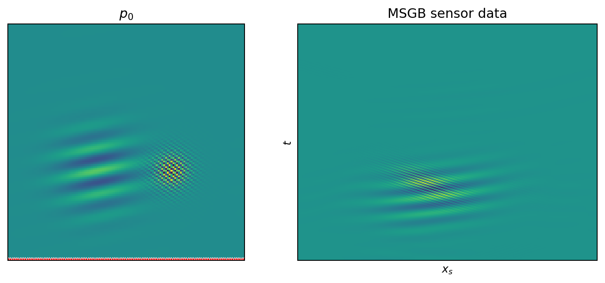

# beamax

[](https://github.com/elma16/beamax/actions/workflows/run-tests.yml)
[](https://codecov.io/gh/elma16/beamax)

[Install](#installation) | [Documentation](https://elma16.github.io/beamax/) | [Examples](examples/README.md)

beamax is a [JAX](https://github.com/jax-ml/jax) library for solving photoacoustic tomography problems using the multiscale Gaussian beam method.

## Installation

Python 3.11 or 3.12 is required.

1. Install JAX for your hardware (CPU/GPU/TPU) following the [official instructions](https://github.com/google/jax#installation).
2. Install `beamax`:

```bash
pip install beamax
```

Optional extras:

```bash
# With matplotlib examples
pip install "beamax[viz-mpl]"

# With k-Wave integration
pip install "beamax[kwave]"
```

For development, see [`CONTRIBUTING.md`](CONTRIBUTING.md).

## Example

This example runs a small 2D photoacoustic forward solve. A high-frequency
$p_0$ is propagated to a planar detector with MSGB.

```python
import jax
import jax.numpy as jnp
import matplotlib.pyplot as plt
import numpy as np

from beamax import Domain, Sensor, DyadicDecomposition, MSWPT
from beamax import transforms, utils
from beamax.gb import gb_solvers
from beamax.solvers import MSGBSolver

# Use double precision for this small MSGB example.
jax.config.update("jax_enable_x64", True)


# Build the same two-packet p0 used by examples/forward/2d_forward.py.
def make_initial_pressure(dyadic):
    grid = dyadic.fourier_meshgrid
    high = transforms.compute_frames(
        dyadic,
        125,
        jnp.array([11, 6]),
        grid,
        redundancy=2,
        windowing="none",
    )
    low = transforms.compute_frames(
        dyadic,
        44,
        jnp.array([11, 3]),
        grid,
        redundancy=2,
        windowing="none",
    )

    p0 = utils.unitary_ifft(high) + utils.unitary_ifft(low)
    p0 = p0 / jnp.max(jnp.abs(p0))
    return p0.T.real


# 1. Define a 128 x 128 PAT domain with homogeneous sound speed.
n = (128, 128)
domain = Domain(
    N=n,
    dx=(1.0e-4, 1.0e-4),
    c=1500.0,
    cfl=0.3,
    periodic=(False, False),
)

# 2. Build the multiscale wave-packet transform and $p_0$.
decomp = DyadicDecomposition(
    num_levels=3,
    N=domain.N,
    num_boxes_levels=(4, 8, 16),
    box_aspect_ratio=(1, 1),
)
wpt = MSWPT(decomp, redundancy=2, windowing="rectangular_mirror")
p0 = make_initial_pressure(decomp)

# 3. Choose a time grid and put a one-sided detector line on the lower boundary.
ts = domain.generate_time_domain()
sensor_mask = jnp.zeros(n).at[0, :].set(1.0)
sensors = Sensor(domain=domain, binary_mask=sensor_mask)

# 4. Configure the MSGB forward solver and keep 4096 beams.
solver = MSGBSolver(
    thr=4096,
    thr_strat="top_n",
    batch_size=128,
    input_type="spatial",
    ode_solver=gb_solvers.solve_hom_diag,
    sum_method="scan_real",
)

# 5. Apply the MSGB forward operator: p0 -> sensor data.
msgb_data = solver.forward(p0, domain, sensors, ts, wpt)
msgb_data = np.asarray(msgb_data.block_until_ready())

# 6. Plot p0 and MSGB sensor data.
fig, axes = plt.subplots(1, 2, figsize=(8, 3.5), constrained_layout=True)
axes[0].imshow(np.asarray(p0), origin="lower", cmap="viridis")
sensor_rows, sensor_cols = np.nonzero(np.asarray(sensor_mask))
axes[0].scatter(
    sensor_cols,
    sensor_rows,
    marker="^",
    c="red",
    s=18,
    edgecolors="white",
    linewidths=0.4,
)
axes[0].set_title(r"$p_0$")
axes[0].set_xticks([])
axes[0].set_yticks([])
axes[1].imshow(msgb_data, origin="lower", aspect="auto", cmap="viridis")
axes[1].set_title("MSGB sensor data")
axes[1].set_xlabel(r"$x_s$")
axes[1].set_ylabel(r"$t$")
axes[1].set_xticks([])
axes[1].set_yticks([])

plt.show()
```

This produces:



For a fuller k-Wave/MSGB/Hybrid comparison, see
[`examples/forward/2d_forward.py`](examples/forward/2d_forward.py).

## Running examples

The public examples are listed in [`examples/README.md`](examples/README.md).
Several have **Open in Colab** links if you want to try them on a GPU or TPU
runtime.

From a local checkout, for example:

```bash
python examples/forward/2d_forward.py
```

Example figures are written under `plots/<category>/`, matching the script's
directory under `examples/`.

## References

beamax's MSWPT/MSGB implementation follows:

- Jianliang Qian and Lexing Ying, ["Fast Multiscale Gaussian Wavepacket Transforms and Multiscale Gaussian Beams for the Wave Equation"](https://doi.org/10.1137/100787313), *Multiscale Modeling & Simulation*, 8(5), 1803-1837, 2010.

## Related Projects

Related acoustic simulation projects:

- [k-Wave](http://www.k-wave.org/) — MATLAB/C++ toolbox for time-domain acoustic and ultrasound simulations.
- [k-Wave-python](https://github.com/waltsims/k-wave-python) — Python wrapper used by beamax through the optional `[kwave]` extra.
- [j-Wave](https://github.com/ucl-bug/jwave) — differentiable acoustic simulations in JAX.

## License

MIT; see `LICENSE`.

## Citation

If you use beamax, please cite this repository. If you use the MSWPT/MSGB method, also cite Qian and Ying (2010).
